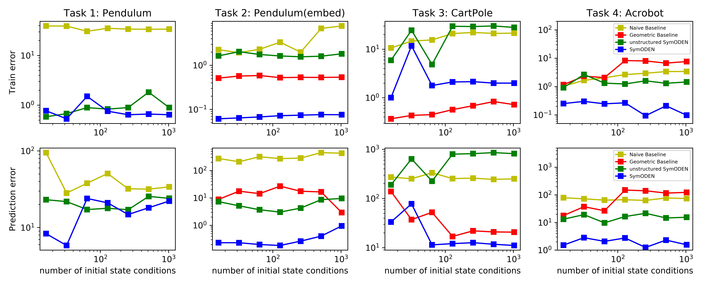
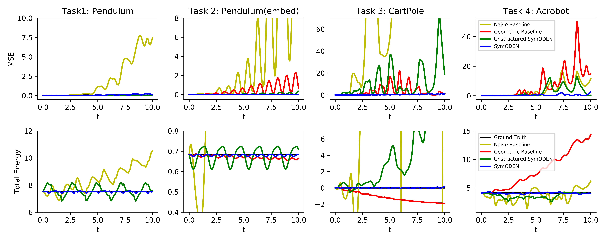

# Symplectic ODE-Net: Learning Hamiltonian Dynamics with Control
Yaofeng Desmond Zhong, Biswadip Dey, Amit Chakraborty | 2019

- Paper: [on Arxiv](https://arxiv.org/abs/1909.12077), [on OpenReview (ICLR2020)](https://openreview.net/forum?id=ryxmb1rKDS)

## Summary
Symplectic ODE-Net (SymODEN) is a deep learning framework which can infer the dynamics of a physical system from observed state trajectories. To achieve better generalization with fewer training samples, SymODEN incorporates appropriate inductive bias by designing the associated computation graph in a physics-informed manner. In particular, we enforce Hamiltonian dynamics with control to learn the underlying dynamics in a transparent way which can then be leveraged to draw insight about relevant physical aspects of the system, such as mass and potential energy. In addition, we propose a parametrization which can enforce this Hamiltonian formalism even when the generalized coordinate data is embedded in a high-dimensional space or we can only access velocity data instead of generalized momentum. This framework, by offering interpretable, physically-consistent models for physical systems, opens up new possibilities for synthesizing model-based control strategies. 

## Performance

**The variation in training error and prediction error with changes in the number of state initial conditions in the training set.**  We can see that SymODEN yields better generalization in all the tasks.  In Task 3, although the Geometric Baseline Model beats the other ones in terms of training error,  SymODEN generates more accurate predictions,  indicating overfitting in the Geometric Baseline Model.  By incorporating the physics-based prior of Hamiltonian dynamics, SymODEN learns dynamics that obey physical law and thus performs better in prediction.  In most cases, SymODEN trained with less training data beats other models with more training data in terms of training error and prediction error, indicating that better generalization can be achieved with fewer training samples.

**The MSE and the total energy evolves along a trajectory with a previously unseen initial condition.** For all the tasks, the MSE of the baseline models diverge faster than SymODEN. The Unstructured SymODEN works well in Task 1, Task 2 and Task 4 but not so well in Task 3.  As for the total energy, in the two pendulum tasks, SymODEN and Unstructured SymODEN conserve total energy by oscillating around a constant value. In these models, the Hamiltonian itself is learnt and the prediction of the future states stay around a level set of the Hamiltonian. Baseline models, however, fail to find the conservation and the estimation of future states drift away from the initial Hamiltonian level set.

## Control Based on Learnt Dynamics
**Task 2: Pendulum(embed):** We train the model using data generated by OpenAI Gym. We modify the action space to allow large actions and change the numerical scheme of the simulator to RK4. After learning the dynamics, an energy-based controller is designed to control the pendulum to the inverted position. 

Here is the rendering of a trajectory and how the state variables and the action (control input) change with time. Black reference lines indicate expected value in the end. 

--------------

**Task 5: Fully-actuated CartPole:** We train SymODEN on fully-actuated CartPole. We modify the action space to allow large control on both the position of the cart and the angle of the pendulum. As before, we change the numerical scheme of the simulator to RK4. With learnt dynamics, an energy-based controller is designed to control the pendulum to the upright position and the cart to the center. 

Here is the rendering of a trajectory and how the state variables and the action (control input) change with time. Black reference lines indicate expected value in the end. 

-------------

**Task 6: Fully-actuated Acrobot:** We train SymODEN on fully-actuated Acrobot. We modify the action space to allow large control on both angles and change the numerical scheme of the simulator to RK4. With the learnt dynamics, an energy-based controller is designed to control the acrobot to the upright position.

Here is the rendering of a trajectory and how the state variables and the action (control input) change with time. Black reference lines indicate expected value in the end. 

## Basic Usage
To train Symplectic ODE-Net(SymODEN):
- Task 1: Pendulum: `python experiment-single-force/train.py --verbose --structure`
- Task 2: Pendulum(embed): `python experiment-single-embed/train.py --verbose --structure`
- Task 3: CartPole: `python experiment-cartpole-embed/train.py --verbose --structure`
- Task 4: Acrobot: `python experiment-double-embed/train.py --verbose --structure`
- Task 5: Fully-actuated CartPole: `python experiment-fa-cartpole/train.py --verbose --structure`
- Task 6: Fully-actuated Acrobot: `python experiment-fa-acrobot/train.py --verbose --structure`

The trained models are stored in this repo using git-lfs. To analyze the models:
- Task 1: Pendulum: [analyze-single-force.ipynb](./analyze-single-force.ipynb)
- Task 2: Pendulum(embed): [analyze-single-embed.ipynb](./analyze-single-embed.ipynb)
- Task 3: CartPole: [analyze-cartpole-embed.ipynb](./analyze-cartpole-embed.ipynb)
- Task 4: Acrobot: [analyze-double-embed.ipynb](./analyze-double-embed.ipynb)
- Task 5: Fully-actuated CartPole: [analyze-fa-cartpole.ipynb](./analyze-fa-cartpole.ipynb)
- Task 6: Fully-actuated Acrobot: [analyze-fa-acrobot.ipynb](./analyze-fa-acrobot.ipynb)

Others:
- Train loss and prediction loss with different number of state initial conditions: [analyze-train-pred-loss.ipynb](./analyze-train-pred-loss.ipynb)
- MSE along a single trajectory: [analyze-MSE.ipynb](./analyze-MSE.ipynb)
- Ablation study (SymODEN and HNN): [analyze-ablation-hnn.ipynb](./analyze-ablation-hnn.ipynb)
- Effects of time horizon : [analyze-effect-tau.ipynb](./analyze-effect-tau.ipynb)

## Dependencies
This project is written in Python 3.7 and tested with the following packages
- OpenAI Gym: 0.14.0
- PyTorch: 1.0.1
- Torchdiffeq: 0.0.1
- Numpy: 1.16.2
- Scipy: 1.2.1
- ImageIO: 2.4.1
